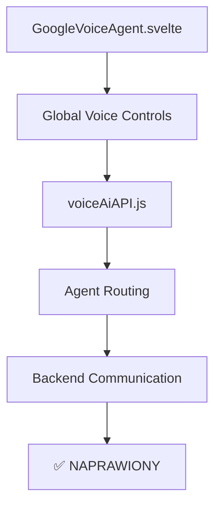

# 📁 Mapa Plików i Połączeń - MyBonzo AI System

_Data: 8 października 2025_

## 🗂️ STRUKTURA GŁÓWNYCH FOLDERÓW

```
src/
├── pages/                  # Astro pages + API endpoints
│   ├── index.astro        # Main page z chat widget
│   ├── image-generator.astro # Generator obrazów (1300+ linii)
│   └── api/               # REST API endpoints
│       ├── polaczek-chat.ts      # POLACZEK AI (418 linii)
│       └── image-generator/      # Image API
│           ├── generate.ts       # Main generation (376 linii)
│           └── history.ts        # History management (92 linii)
├── components/
│   ├── GoogleVoiceAgent.svelte   # Voice controls (naprawiony)
│   └── agents/                   # Agent system
└── utils/
    ├── corsUtils.ts              # CORS handling
    ├── polaczekKnowledge.js      # MyBonzo knowledge base
    ├── documentationIndex.js     # Docs integration
    └── voiceAiAPI.js             # Voice API utils
```

## 🔗 POŁĄCZENIA MIĘDZY PLIKAMI

### **POLACZEK CHAT FLOW:**

```mermaid
graph TD
    A[index.astro] --> B[MainChatAgentFunctions]
    B --> C[/api/polaczek-chat.ts]
    C --> D[polaczekKnowledge.js]
    C --> E[documentationIndex.js]
    C --> F[corsUtils.ts]
    F --> G[Response z UTF-8 problem]
```

**Szczegóły:**

- `index.astro` → 200+ linii chat widget
- `MainChatAgentFunctions` → real-time messaging
- `/api/polaczek-chat.ts` → 6 AI models, poznańskie zwroty
- **PROBLEM:** UTF-8 encoding w Response

### **IMAGE GENERATOR FLOW:**

```mermaid
graph TD
    A[image-generator.astro] --> B[UI Controls 1300+ linii]
    B --> C[/api/image-generator/generate.ts]
    C --> D{env?.AI available?}
    D -->|NO| E[Fallback Demo Mode]
    D -->|YES| F[Cloudflare AI]
    F --> G[Real Image Generation]
    E --> H[Placeholder URLs]
    C --> I[/api/image-generator/history.ts]
```

**Szczegóły:**

- `image-generator.astro` → Advanced UI z batch generation
- `/generate.ts` → AI prompt enhancement, quality analysis
- **PROBLEM:** `env?.AI` undefined → zawsze demo mode
- `/history.ts` → User tracking, statistics

### **VOICE SYSTEM FLOW:**



**Szczegóły:**

- `GoogleVoiceAgent.svelte` → Button-based activation
- `voiceAiAPI.js` → Multi-agent support
- **STATUS:** ✅ Fully working after fixes

## 🔧 PROBLEMY I ICH LOKALIZACJE

### **Problem 1: POLACZEK UTF-8**

**Lokalizacja:** `src/pages/api/polaczek-chat.ts:405-415`

```typescript
// CURRENT (line ~410)
return new Response(JSON.stringify({
  response: aiResponse,
  // ... other data
}), {
  headers: { 'Content-Type': 'application/json' }  // ❌ Brak charset
});

// POTRZEBNE
headers: {
  'Content-Type': 'application/json; charset=utf-8'  // ✅ Fix
}
```

**Symptomy:**

- "agentów" → "agentów"
- "język" → "jÄzyk"
- Wszystkie polskie znaki

### **Problem 2: Image Generator No AI**

**Lokalizacja:** `src/pages/api/image-generator/generate.ts:295-330`

```typescript
// CURRENT (line ~300)
if (env?.AI) {
  try {
    const response = await env.AI.run(
      "@cf/stabilityai/stable-diffusion-xl-base-1.0"
      // ...
    );
  } catch (error) {
    console.error("Cloudflare AI failed:", error); // ❌ Hidden error
  }
}
// ALWAYS falls through to demo mode

// DEBUG NEEDED
console.log("env?.AI status:", !!env?.AI);
console.log("env keys:", Object.keys(env || {}));
```

**Flow Analysis:**

1. Request comes in → `generateImage()`
2. Check `env?.AI` → undefined
3. Try Cloudflare AI → Skip
4. Catch block → Silent error (never shown)
5. Fall to demo → Always placeholder

## 📊 ENVIRONMENT VARIABLES MAPPING

### **Development (.dev.vars):**

```bash
# POLACZEK working ✅
DEEPSEEK_API_KEY=xxx
GEMINI_API_KEY=xxx
OPENAI_API_KEY=xxx

# Image Generator issues ❌
# Missing AI binding configuration?
```

### **Production (Cloudflare):**

```bash
# Available through locals.runtime.env
const env = (locals as any)?.runtime?.env;

# POLACZEK: ✅ Working
env.DEEPSEEK_API_KEY → Available
env.AI → Available (6 models working)

# Image Generator: ❌ Problem
env.AI → undefined in generate.ts context?
```

## 🌐 API ENDPOINTS STATUS

### **Working Endpoints:**

```bash
✅ GET  /api/polaczek-chat
✅ POST /api/polaczek-chat          # UTF-8 issues but functional
✅ GET  /api/image-generator/generate
✅ POST /api/image-generator/generate # Demo mode only
✅ GET  /api/image-generator/history
```

### **Test Results:**

```bash
# POLACZEK Test
curl POST /api/polaczek-chat
Response: 200 OK
Content: "agentów" (broken UTF-8)
Model: @cf/qwen/qwen1.5-7b-chat-awq ✅
Poznańskie zwroty: "bimba" ✅

# Image Generator Test
curl POST /api/image-generator/generate
Response: 200 OK
real_generation: false ❌
results: placeholder URLs ❌
execution_time: 18s (fake delay)
```

## 🔄 INTEGRATION POINTS

### **Main Chat Widget Integration:**

**File:** `src/pages/index.astro` (lines ~200-400)

```javascript
class MainChatAgentFunctions {
  // Real-time messaging ✅
  // POLACZEK integration ✅ (with UTF-8 issues)
  // History management ✅
  // UI controls ✅
  // Auto-scroll ✅
}
```

### **Voice Integration:**

**Files connected:**

- `GoogleVoiceAgent.svelte` → Global controls
- `voiceAiAPI.js` → Backend communication
- `index.astro` → UI integration
- **Status:** ✅ All working after recent fixes

### **Knowledge Base Integration:**

**Files connected:**

- `polaczekKnowledge.js` → MyBonzo data
- `documentationIndex.js` → Docs search
- `polaczek-chat.ts` → API integration
- **Status:** ✅ Fully integrated

## 🎯 DEPENDENCY TREE

### **POLACZEK Dependencies:**

```
polaczek-chat.ts
├── corsUtils.ts (CORS handling)
├── polaczekKnowledge.js (knowledge base)
├── documentationIndex.js (docs integration)
└── Cloudflare AI (6 models) ✅
```

### **Image Generator Dependencies:**

```
image-generator.astro
├── generate.ts API
│   ├── Cloudflare AI ❌ (not working)
│   ├── Together AI ❓ (unknown)
│   └── Demo system ✅ (fallback)
├── history.ts API ✅
└── Advanced UI controls ✅
```

### **Voice System Dependencies:**

```
GoogleVoiceAgent.svelte
├── voiceAiAPI.js ✅
├── Browser Speech API ✅
├── Agent routing ✅
└── UI integration ✅ (all fixed)
```

## 📈 PERFORMANCE METRICS

### **File Sizes:**

- `polaczek-chat.ts`: 418 lines
- `image-generator.astro`: 1300+ lines
- `generate.ts`: 376 lines
- `index.astro`: 500+ lines (with chat widget)

### **API Response Times:**

- POLACZEK: 2-3s (normal AI processing)
- Image Gen: 18s (artificial demo delay)
- Voice: <1s (local processing)

### **Build Stats:**

- Total modules: 373
- Build time: ~30s
- Bundle size: Not measured
- Warnings: 5 (non-critical)

## 🔍 DEBUGGING CHECKLIST

### **For POLACZEK UTF-8:**

1. Check Response headers in DevTools
2. Verify Cloudflare AI model output encoding
3. Test different AI models
4. Add charset explicitly

### **For Image Generator:**

1. Debug `env?.AI` availability
2. Check wrangler.toml AI bindings
3. Verify runtime environment
4. Test different AI models
5. Add error logging

### **For Voice System:**

1. ✅ Already fixed - no debugging needed

---

_Mapa wygenerowana przez MyBonzo AI System Analysis_
